# dsh-IDE — An All-in-One IDE for the DSH Web GUI (JupyterLab-style Workspace + SSH Remote Development)

<p align="center">
  
  
  
</p>

> [中文](README.md) | **English**

Turn the DeepSeek Harness (DSH) Web GUI into an **all-in-one development environment** with four core
capabilities:

- 🖥️ **Right sidebar**: a dockable right-hand drawer — file tree + preview/editor in one pane; **drag a tab
  out into a floating window, drag it back to the right edge to auto-dock** (bottom / right drawer / float /
  triple-IDE)
- 📄 **Preview**: Markdown / HTML / image / CSV / Office (docx / xlsx / pptx) / log rendered in place
- ✏️ **Edit**: live code editing (syntax highlight + line numbers + zebra stripes) + Word-style visual
  editing for Markdown/HTML + in-frame rich-text Office editing
- 🧩 **IDE**: file tree, terminal, Trae-style red/green diffs, type-colored tabs, Git badges, watch paths —
  an out-of-the-box JupyterLab-style workspace

It also ships with an **SSH remote workspace mode**: configure an SSH host (password / key, reusing
`~/.dsh/dsh-ssh.json`) from the top-right corner (left of the session log); once connected, the right
panel switches to the remote file tree, and **the model's local read / write / edit / glob / grep and
bash / terminal execute transparently on the remote server** while the LLM and agent loop stay local —
"local brain, remote hands".

## Feature Overview

### ⚙️ Right-side Workspace Settings (inside the system settings)

"Settings" → "Right-side Workspace" manages the workspace's **feature toggles** (8: auto-diff / watch dots / Git badges / syntax highlight / zoom / triple-IDE / terminal dock / session isolation) and the **editor toolbar tools** (9, for rich-text editing), rendered as rounded cards with switches — changes apply immediately and persist.

### 🖼️ Markdown Preview (Three Layouts)

Markdown files render directly in the panel (cyan tab), switchable between three layouts:

- **Bottom pane (⇊)**: preview shown in the lower pane
- **Right pane (⇉)**: preview shown in the right code column
- **Floating overlay (⇱)**: floats over the chat, wider

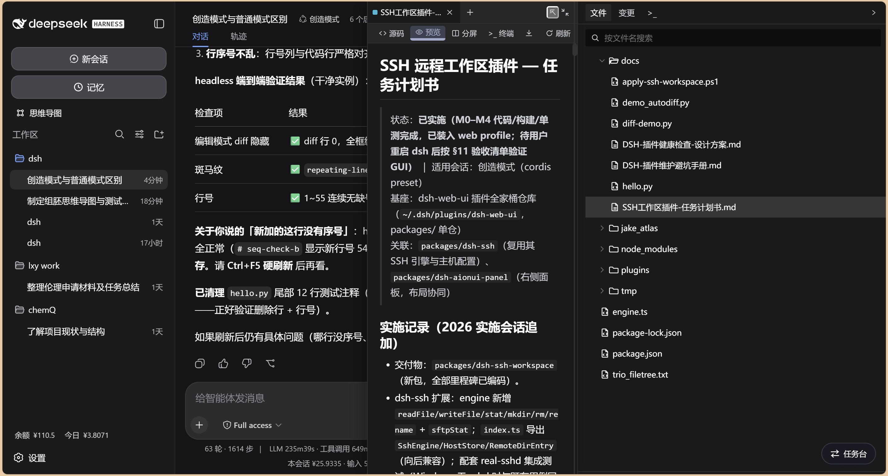
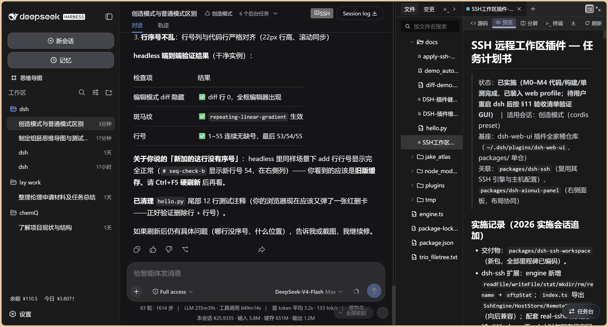
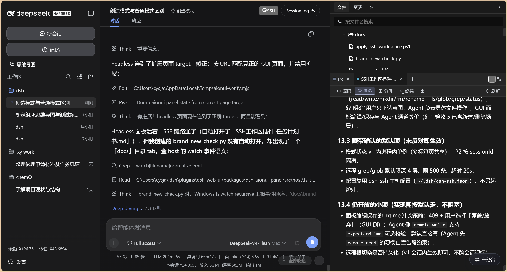

### 🌳 Left File Tree

Lazy-loaded file tree with filename search, **Git status badges** (A/M/D/R/U/C), a context menu
(**New File / New Folder** / download / **inline rename** / copy / paste / **delete to Recycle Bin**),
auto-switching between the local working directory and the SSH remote directory. An already-open file
**never opens twice** — external changes refresh its tab in place.

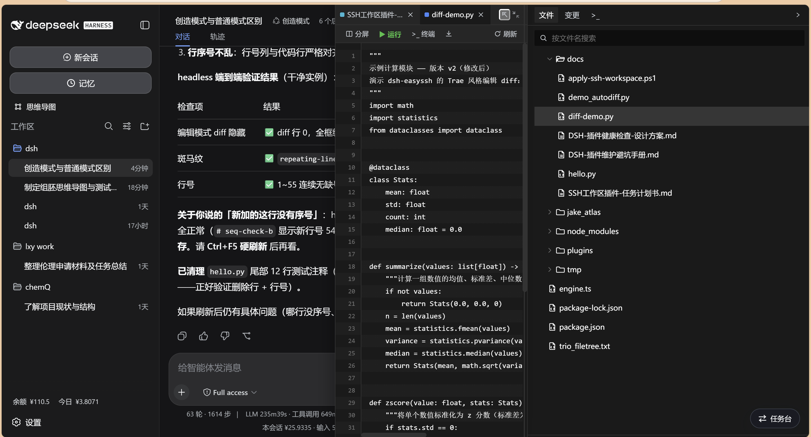

**🔍 Watch paths (auto-open scope)**: by default only the FIRST level is watched (files directly under
the root and its first-level dirs). Click the **dot** on a directory row to switch: **amber** = watch the
next level of this directory, **green** = watch ALL levels (n) under it, click again to reset; marks are
remembered per session. A rule explainer box sits in the tab bar (right of Files / Changes / >_). Build
artifacts, temp files and lockfiles NEVER pop regardless of marks.

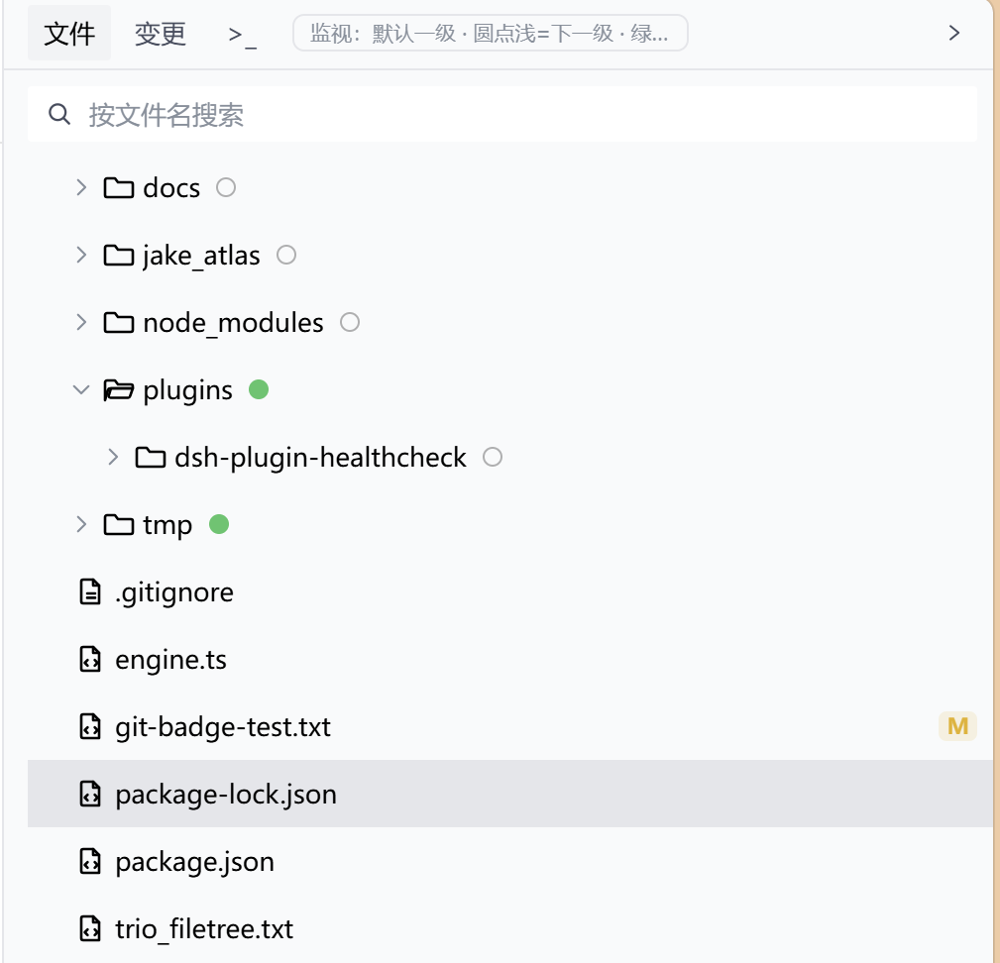

### 📊 Status Bar

The bottom status bar shows the workspace state.

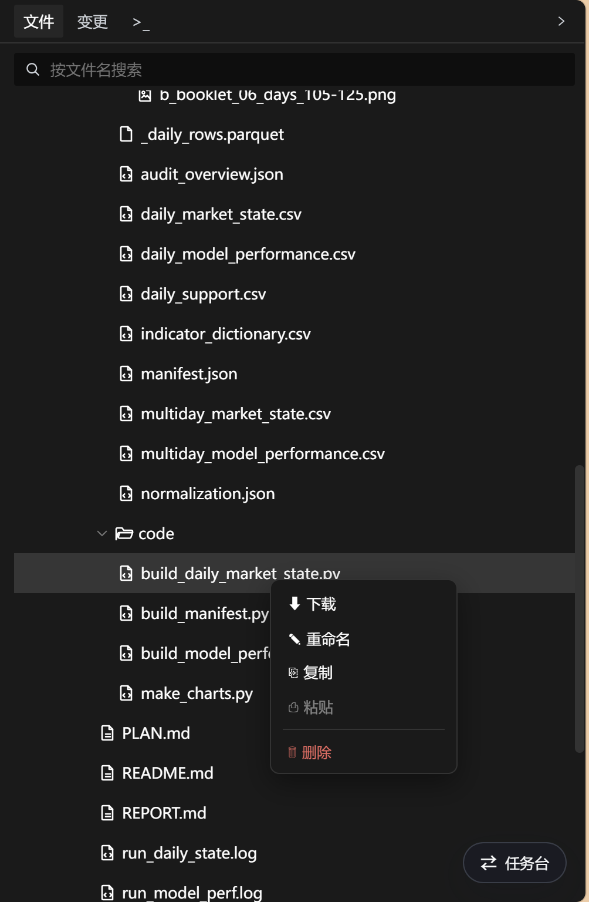

### ✏️ Live Code Editing

Editable code area with **colorful syntax highlighting** (Trae-style palette, **auto-switching with the
light/dark theme**), line numbers and zebra striping (aligned to code lines and following scroll),
Ctrl+S save with mtime conflict detection; the toolbar offers split (editor | preview), refresh, and more.

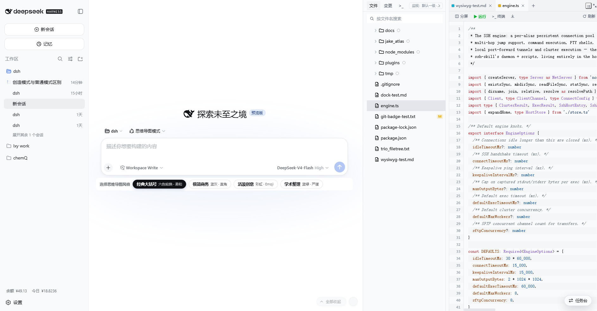

### 🔴🟢 Red/Green Annotations (Trae-style Edit Diff)

**Any external edit** (agent tool writes, other processes) automatically pops an "Update(path)" card into
the **bottom pane** — Added/removed stats, deleted lines in red, added lines in green; every edit pops its
own card (baseline auto-advances, no repeats, no misses). Saving pops one too:

- **Brand-new files (no baseline) pop an all-GREEN card** (the whole file counts as added)
- **Deleted files pop an all-RED card** (the whole file counts as removed)
- The card carries a fixed **two-column line-number gutter** (old / new aligned), zebra-striped unchanged rows
- Click "**Edit latest version**" — the editor covers the whole frame so you can modify and save the
  latest code directly (red/green refresh automatically); clicking "**Refresh**" never loses the colors

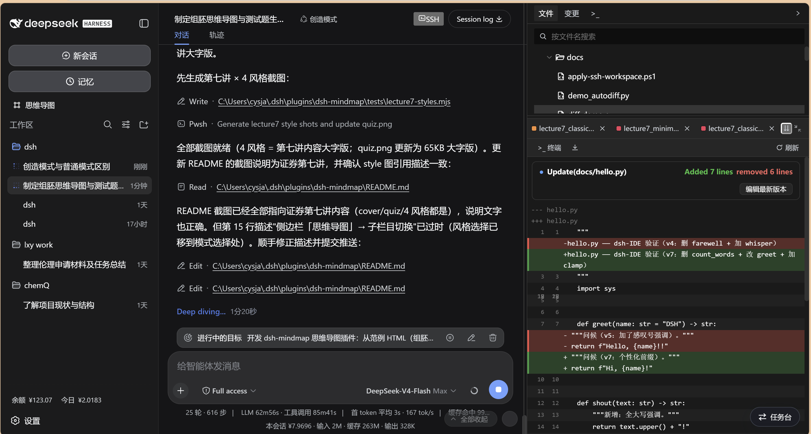

### 🎨 Color Markers (Type-colored Tabs)

Every open tab carries a type color — **orange** = image, **green** = CSV, **blue** = Python, **yellow** =
JS/TS, **purple** = JSON, **cyan** = Markdown, **red** = diff, **gray** = log — scannable at a glance even
with many tabs; newly opened files and diffs auto-scroll into view, and the tab bar scrolls horizontally
with truncated titles.

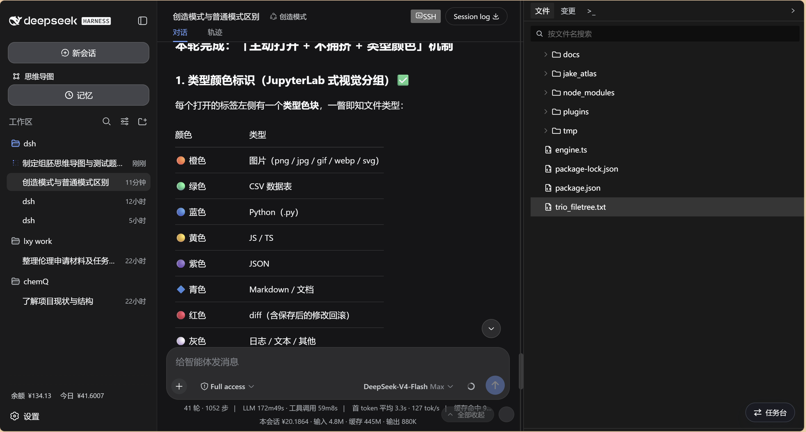

### ⌨️ Terminal & Run

Built-in command-line terminal: "▶ Run" executes the current file directly (python / node / bash etc.),
">_ Terminal" opens a command panel for ad-hoc commands (both run remotely in SSH mode); a standalone
terminal entry also lives on the file tab bar. The terminal docks at the BOTTOM FIFTH of the chat column
in a faithful terminal look (SimHei font, macOS traffic-light dots, ❯ prompt, green caret) without
overlapping the conversation.

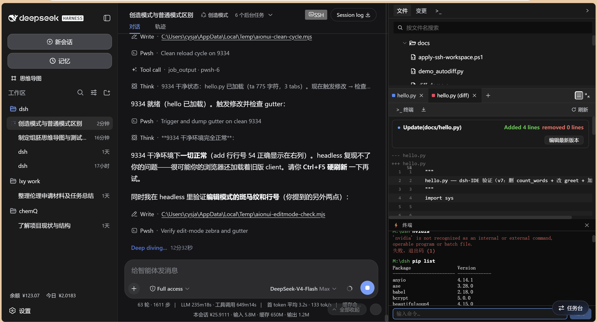

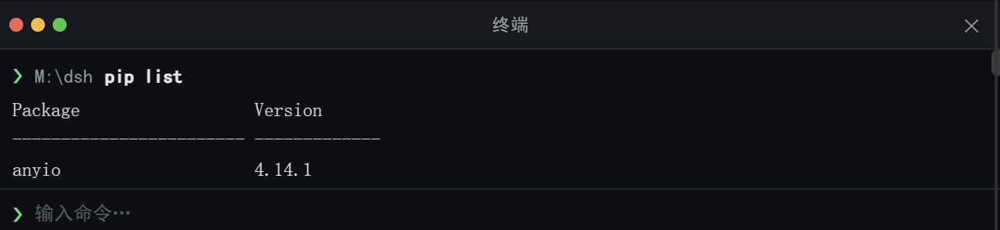

### 📜 Log Preview

Log files (gray tab) preview directly in the panel.

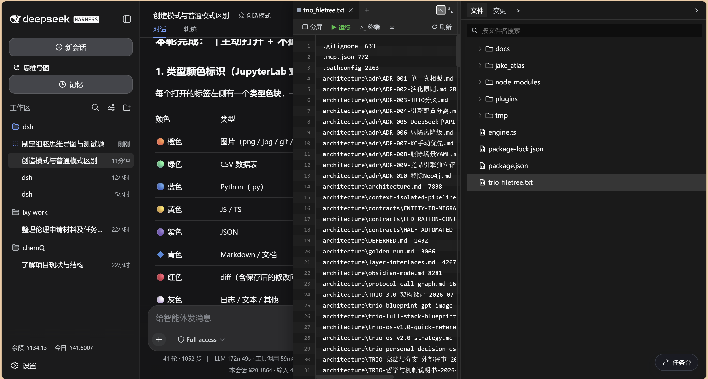

### 🖼️ Image / 📋 CSV / 🌐 HTML Previews

- **Images** (orange tab) and **HTML** (purple tab) previews support **zoom**: toolbar − / % / + / 1:1 /
  fit-width, or **Ctrl+wheel**
- **CSV** data renders as a table (green tab)

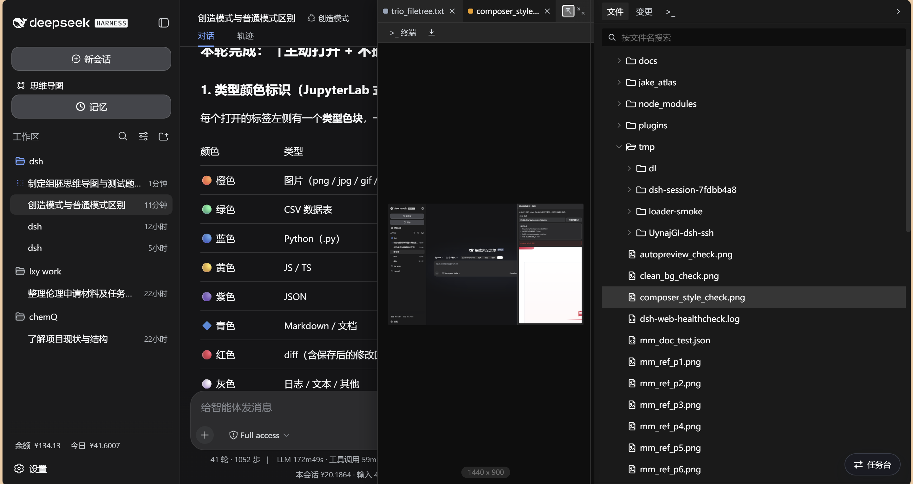
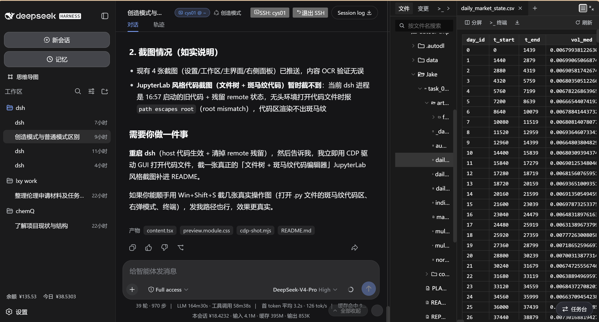
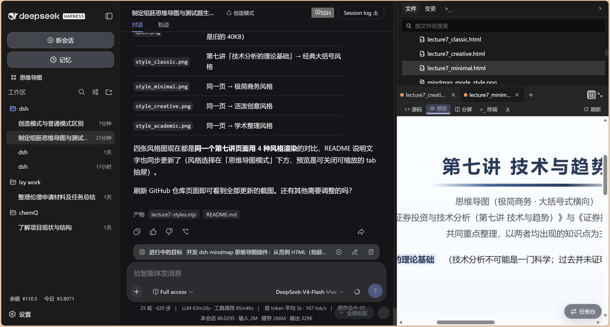

### 🖥️ Right Sidebar (dockable drawer · drag to detach / dock)

- **Right drawer (default)**: the preview docks in the right-hand column (file tree + preview in one drawer); four modes cycle — bottom (⇊) / **right drawer (⇉)** / float (⇱) / **triple IDE (⿻)** — chat | files | preview side by side
- **Drag a tab out into a float**: in ANY layout, grab the preview **tab bar / toolbar empty area** and drag to pull the preview out into a floating window; it follows the pointer 1:1 with smooth, jank-free animation
- **Drag to the right edge to dock back**: release the float flush against the screen's **right edge** to auto-dock back into the right drawer; release near "cover the file tree (tree auto-collapses to a round button) / below the tree / chat-below" to snap to that preset, or drag out of a zone to free-float again
- **Resize the float**: drag the bottom-right grip to change width + height (size remembered, kept across snap)
- **Focus rail**: with the preview open, collapse the file tree — it shrinks to a round floating button + a far-right drawer handle; the preview keeps its width. Click the round button to toggle the floating file-tree popup; click the far-right handle to re-dock the drawer


### 🧬 R Language Support

`.R` / `.r` scripts run with **Rscript** (▶ Run), R tabs use the official R blue; `.Rmd` (R Markdown)
renders as Markdown; syntax highlighting supports R natively.

### 📄 Office Preview (docx / xlsx / pptx)

- **docx**: paragraphs / tables / bold / italic / underline / color / size / highlight / alignment / fonts (incl. CJK `w:eastAsia`) / paragraph & run shading / **inline images & shape photos** (`w:drawing`/`a:blip`, incl. `mc:AlternateContent` shapes) / **content controls** (`w:sdt`) / **headers & footers** (letterhead logos from `header1.xml` etc.) rendered
- **xlsx**: first worksheet rendered as a table (shared strings resolved)
- **pptx**: one card per slide
- Client-side ZIP parsing — no host dependencies, no dsh restart

### ✏️ In-frame Rich Editing (Office)

The toolbar's "Edit" arms contenteditable editing: the toolbar shows only the tools checked in
Settings (font / size / bold-italic / align / underline / color / highlight / spacing / margins); saving
rebuilds the docx/xlsx/pptx from the edited HTML and writes it back as binary (mtime-conflict guarded;
run formatting — bold / italic / underline / color / size / font / highlight — survives edit + save).
Known limit: charts (`word/charts/*`) and embedded objects (embedded Excel) are not parsed or preserved.

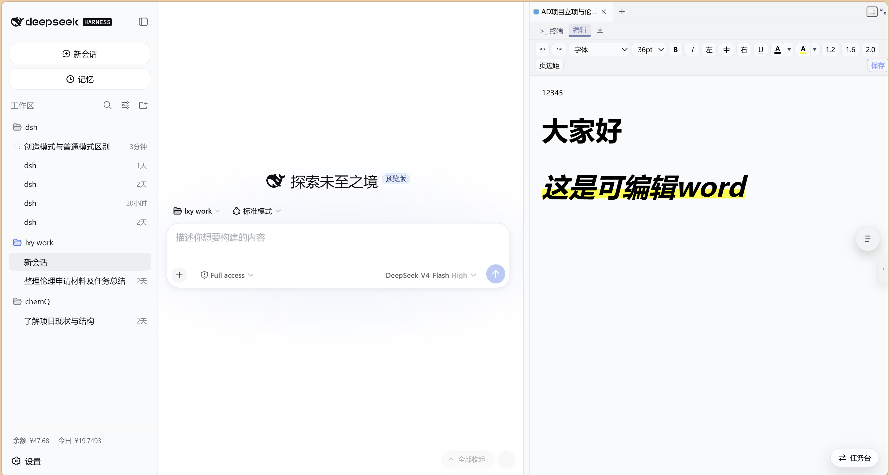

### 🎨 HTML / Markdown Visual Editing (Word-style in-place)

The toolbar's "Visual editing" makes the rendered result itself the editable document (no more floating
text boxes) — edit directly on the rendered page like Word. **Markdown** edits the compiled HTML and
converts back to Markdown on save (titles with hyphens stay mojibake-free, code fences keep their
language); **color / font-size / font-family / underline / highlight** persist as a strictly-sanitized
inline-HTML subset, so changing the text color no longer paints the background and bold/italic/size
survive saving. **HTML** edits the FULL document in a design-mode iframe (PPT-style rich editing: color
/ size / bold-italic / align / underline / highlight) — the original `<style>` and canvas background
render as-is, and saving serializes the whole document (no more single-column body-fragment overlay).
The toolbar provides bold / italic / underline / color / highlight / font / size / align / undo / redo. Text color and highlight are **Word-style buttons**: one click on the "A" applies the currently remembered color to the selection (a bar under the A shows the current color), and the small "▾" opens a palette where picking a swatch both remembers and applies it — no more multi-click color picking, and color can now be combined with bold/italic on the same selection. The toolbar **lights up the buttons matching the current selection's formatting** (bold / italic / underline / align / color / highlight get a shadow), so you can see at a glance what formatting the selected text carries.


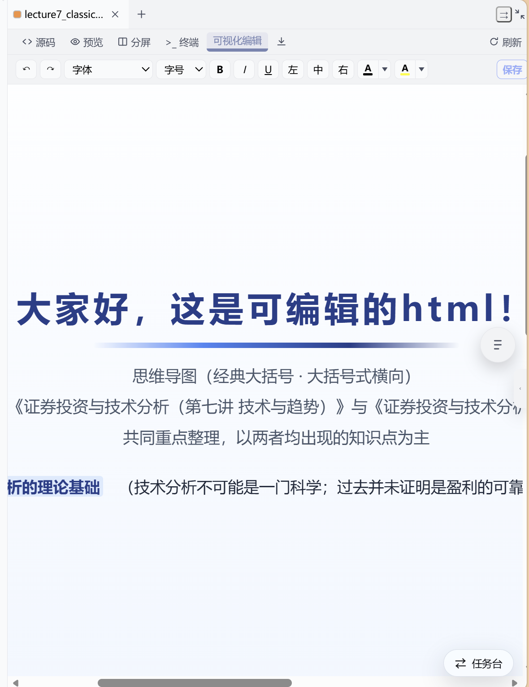

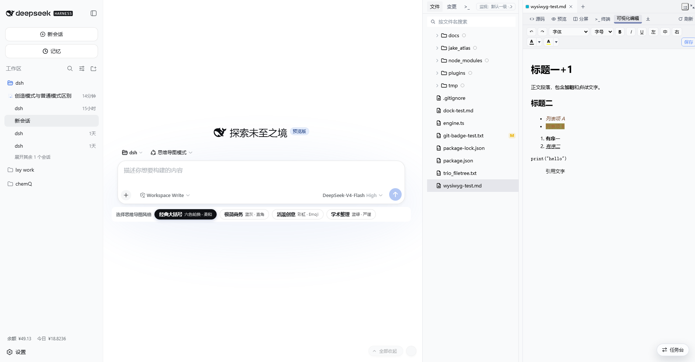

### 🚀 SSH Remote Development (Local Brain, Remote Hands)

- **Seam switching**: a profile patch routes `ctx.fs` / `ctx.subprocess` through a mode facade — local mode
  delegates to the deployment's sandboxed implementations, SSH mode to SFTP/SSH remote implementations
  (atomic writes, version checks, CRLF handling, streaming output, PTY terminals). Model tools run
  remotely with zero changes.
- **Remote filesystem**: a full `@deepseek-ai/dsh-fs` implementation — paths / versions / atomic writes /
  CRLF / canonical path transfer.
- **Remote subprocess**: a full `@deepseek-ai/dsh-subprocess` implementation — exec + PTY terminal with
  overflow spooling to local disk.
- **Multiple hosts**: configure many hosts in the GUI (ProxyJump chains, passphrase keys), one-click
  switching; a settings-page management section (add / edit / delete / test / enter-exit) persists to
  `~/.dsh/dsh-ssh.json`.
- **Rounded pill buttons + multi-host picker**: the session-header SSH button is a rounded pill
  (brand-tinted while remote); the connect dialog lists saved hosts on top — click to enter any of them.
- **Per-session SSH isolation**: every session remembers its own device and mode; switching sessions
  restores it (different sessions can be remote on different hosts or local). Limitation: the host-side
  fs/subprocess seams route on the global mode; isolation applies to the panel and explicit remote_* tools.
- **Symlink following**: the remote file tree resolves symlinked directories correctly (e.g. AutoDL's
  `/root/autodl-tmp`).
- **Explicit remote tools**: `remote_status` / `remote_ls` / `remote_read` / `remote_write` /
  `remote_mkdir` / `remote_rm` / `remote_rename` / `remote_glob` / `remote_grep`, plus `ssh_exec` /
  `ssh_upload` / `ssh_download`.

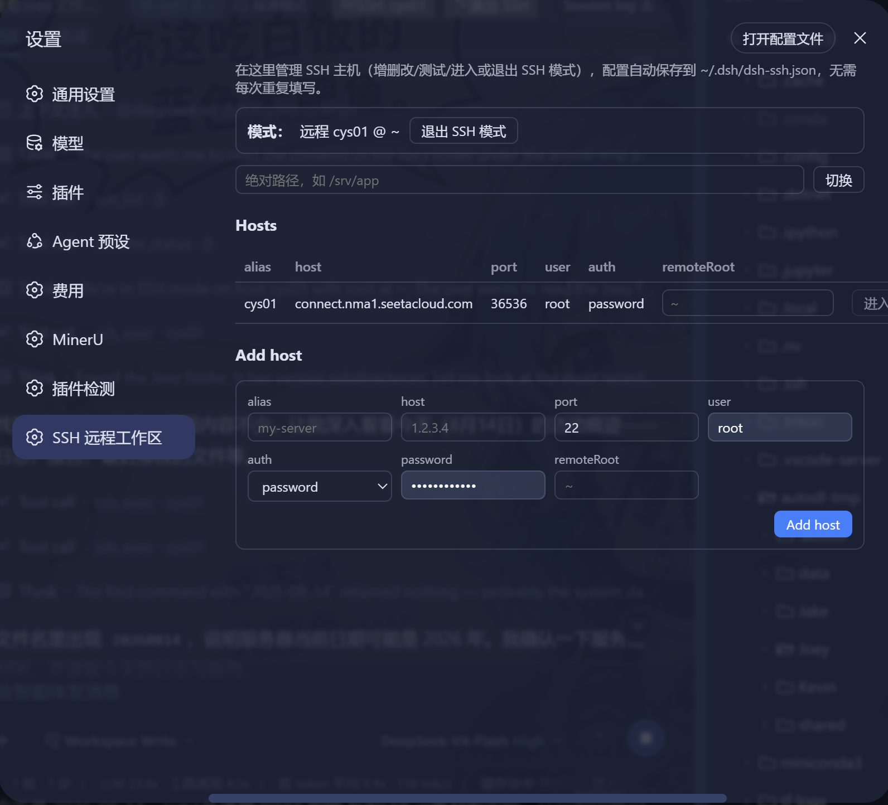

SSH host configuration: alias / host / port / user / password or key / remote root — save, test the
connection, then enter SSH mode in one click.

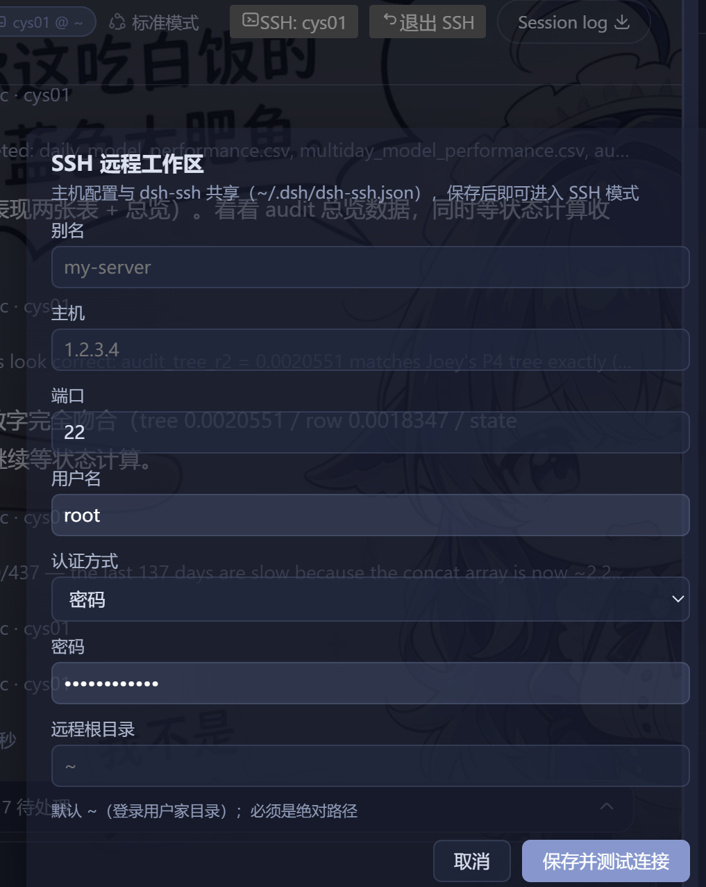

In SSH mode the right panel switches to the remote file tree, and read / write / edit / glob / grep and
the terminal execute transparently on the remote server.

## Quick Start

- **Switch layout**: the "⇊ / ⇉ / ⇱" button on the preview tab bar cycles bottom pane / right drawer
  (default) / floating overlay (wider).
- **Drag to detach / dock**: grab the tab bar or toolbar empty area to pull the preview out into a float;
  drag it flush to the right edge and release to dock back into the right drawer.
- **Edit files**: open `.py` / `.md` / `.js` etc. → type directly → Ctrl+S (mtime conflict check).
- **Run code**: open `.py` / `.js` / `.sh` etc. → "▶ Run" in the toolbar (runs on the remote host in SSH mode).
- **Open a terminal**: ">_ Terminal" in the preview toolbar, or the ">_" button on the file tab bar
  (works without opening a file).
- **See diffs**: cards pop automatically on external edits / saves; "Edit latest version" to modify
  directly, "Refresh" keeps the colors.
- **File context menu**: download / rename / copy / paste / delete (same locally and remotely).

## Repository Layout

```
dsh-IDE/
├── packages/
│   ├── dsh-aionui-panel/ # Right-panel system: file tree/preview/terminal/edit diff/type colors
│   ├── dsh-ssh/          # SSH engine: ssh2 pool, exec/PTY/SFTP/tunnel/cluster
│   └── dsh-easyssh/      # SSH remote workspace: mode state machine, seam facades, remote impl, GUI
└── README.md
```

> The right file panel (file tree / preview / terminal / context menu / edit diff) is provided by
> **dsh-aionui-panel**, maintained in this repo alongside dsh-IDE; dsh-easyssh drives it through the
> `sshWorkspaceMode` cross-plugin service. SSH remote development is only one of dsh-IDE's capabilities —
> local directories enjoy the full IDE workspace too.

## Installation

Prerequisites: Node.js ≥ 22, pnpm, and dsh installed (`npx @deepseek-ai/dsh`).

```sh
# 1) Clone and build
git clone https://github.com/chenw2759-wq/dsh-IDE.git
cd dsh-IDE
pnpm install
pnpm --filter "./packages/dsh-aionui-panel" build
pnpm --filter "./packages/dsh-ssh" build
pnpm --filter "./packages/dsh-easyssh" build

# 2) Install the three packages into the web profile (use your own absolute paths)
dsh plugin --profile web add file:C:/your-path/dsh-IDE/packages/dsh-aionui-panel
dsh plugin --profile web add file:C:/your-path/dsh-IDE/packages/dsh-ssh
dsh plugin --profile web add file:C:/your-path/dsh-IDE/packages/dsh-easyssh
```

> The repo is branded dsh-IDE; the core plugin package keeps the install id `dsh-easyssh`.

> 💡 **pnpm build approval (one line)**: dsh-ssh depends on native libraries (ssh2 / cpu-features)
> that need to be built. pnpm 10+ blocks dependency build scripts by default, so `dsh plugin add`
> reports `ERR_PNPM_IGNORED_BUILDS: Ignored build scripts: cpu-features@0.0.10, ssh2@1.17.0` and
> **writes placeholders automatically** into `<profile>/pnpm-workspace.yaml`:
>
> ```yaml
> allowBuilds:
>   cpu-features: set this to true or false
>   ssh2: set this to true or false
> ```
>
> Change both `set this to true or false` to `true`, then **re-run the `dsh plugin add` command from
> step 2** (re-running is idempotent). This is the standard pnpm flow — the same for any plugin with
> native dependencies.

### Step 3: seam switch (automatic — nothing to edit)

Installing dsh-easyssh automatically applies its bundled `cordis.patch.yml` (declared via
`dsh.bundle.patch`) as a profile bundle layer: it disables the deployment's `fs-sandbox` /
`subprocess` and mounts the mode-routing facades `easyssh-fs` / `easyssh-subprocess` (in SSH mode the
model's tools execute remotely; in local mode the facades delegate back to the same sandboxed local
implementations). **No manual `<profile>/cordis.patch.yml` editing is required.**

> ⚠️ **Upgrading users must read**: hand-writing the seam patch belongs to **versions before 0.1.0
> only**. If you wrote the patch into `<profile>/cordis.patch.yml` (Windows default
> `C:\Users\<you>\.dsh\profiles\web\cordis.patch.yml`) following the old docs, you MUST delete it
> (restore the file to `[]`) after upgrading — otherwise the automatic patch and the hand-written one
> each insert the same `ssh-workspace-fs` / `ssh-workspace-subprocess` rows and the loader fails with
> a `duplicate loader entry id` error on startup. Delete it and restart; the automatic patch is
> identical to the old hand-written one (same row ids).

### Step 4: restart

```sh
# restart dsh
npx @deepseek-ai/dsh web
```

Open `http://127.0.0.1:3080` → **Ctrl+F5 hard refresh** (required when the browser caches old client
bundles) → configure a host via the SSH button → enter SSH mode.

> Rollback = restore `cordis.patch.yml` to `[]` and restart.

## Usage

1. Click **SSH** at the top right of the session (left of the session log) → fill in host
   (alias / host / port / user / password or key / remote root) → save & test → enter SSH mode.
2. The right panel switches to the remote file tree automatically; just tell the agent "read/change
   remote files" or "run a command on the server" — ordinary tools execute remotely.
3. Path rules: use remote absolute paths directly; relative paths resolve against `remoteRoot`
   (default `~`); do not use Windows local paths.
4. The top-right toggle returns to local mode any time.

## Security

- Routes are loopback-only (same-origin checked); credentials live in `~/.dsh/dsh-ssh.json` (0600).
- Remote operations consume real remote resources — confirm before acting; **the local sandbox does not
  apply to remote execution in SSH mode**.
- Remote grep/glob/realpath rely on GNU find/grep/coreutils.

## Credits

The remote `ctx.fs` / `ctx.subprocess` implementations are ported and adapted from
[UynajGI/dsh-ssh](https://github.com/UynajGI/dsh-ssh) (MIT, see file headers and NOTICE), extended with a
full Web GUI frontend and runtime mode switching.

## License

BSD-3-Clause. The MIT copyright of the remote implementations belongs to the UynajGI/dsh-ssh authors (see NOTICE).
